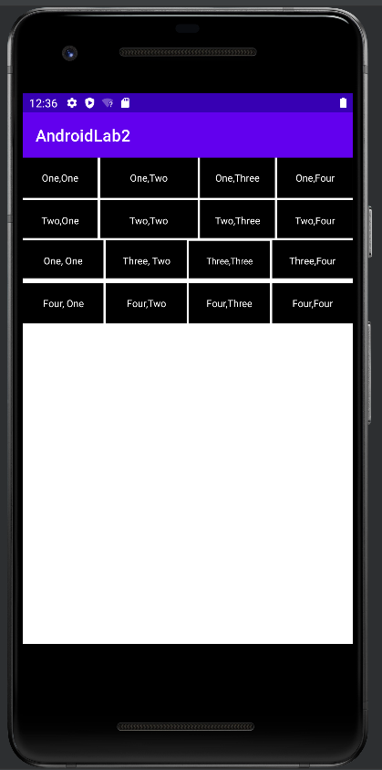
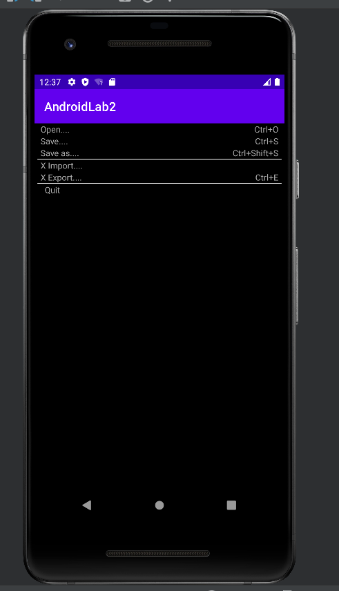
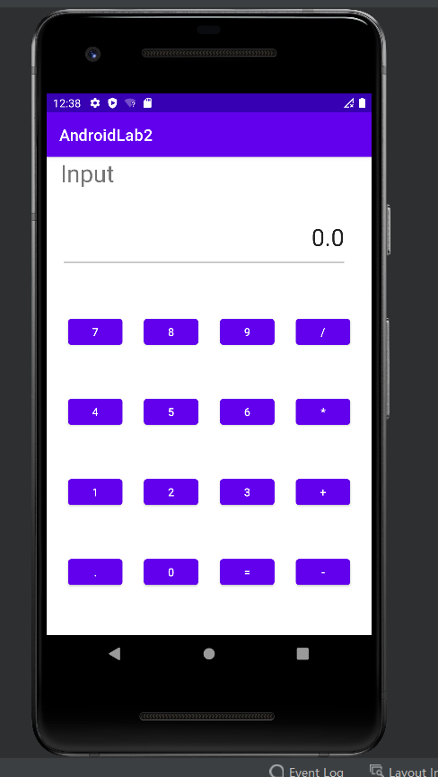
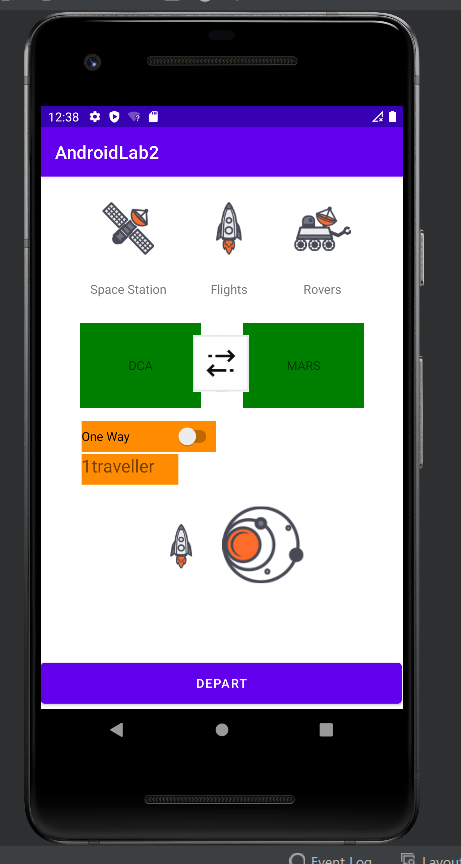

# AndroidLab2  界面布局
### Test1 线性布局
##### 思路

①四个Linearlayout通过android:orientation="horizontal"垂直排布
②在Linearlayout内存放四个Textview调整其大小即可

##### 部分实验代码
```
    <LinearLayout
            android:layout_width="match_parent"
            android:layout_height="50dp"
            android:orientation="horizontal"
            >


            <TextView
                android:layout_width="0dp"
                android:layout_height="50dp"
                android:layout_weight="1"
                android:text="One,One"
                android:background="#000000"
                android:textColor="#FFFFFF"
                android:textColorHighlight="#FFFFFF"
                android:textColorHint="#FFFFFF"
                android:textColorLink="#FFFFFF"
                android:textSize="12sp"
                android:gravity="center"
                />
            <TextView
                android:layout_width="0dp"
                android:layout_height="50dp"
                android:layout_weight="1.3"
                android:layout_marginStart="3dp"
                android:text="One,Two"
                android:background="#000000"
                android:textColor="#FFFFFF"
                android:textColorHighlight="#FFFFFF"
                android:textColorHint="#FFFFFF"
                android:textColorLink="#FFFFFF"
                android:textSize="12sp"
                android:gravity="center"/>
            <TextView
                android:layout_width="0dp"
                android:layout_height="50dp"
                android:layout_marginStart="3dp"
                android:layout_weight="1"
                android:text="One,Three"
                android:background="#000000"
                android:textColor="#FFFFFF"
                android:textColorHighlight="#FFFFFF"
                android:textColorHint="#FFFFFF"
                android:textColorLink="#FFFFFF"
                android:textSize="12sp"
                android:gravity="center"/>
            <TextView
                android:layout_width="0dp"
                android:layout_height="50dp"
                android:layout_weight="1"
                android:layout_marginStart="3dp"
                android:text="One,Four"
                android:background="#000000"
                android:textColor="#FFFFFF"
                android:textColorHighlight="#FFFFFF"
                android:textColorHint="#FFFFFF"
                android:textColorLink="#FFFFFF"
                android:textSize="12sp"
                android:gravity="center"/>
        </LinearLayout>
```
##### 实验结果



### Test2 表格布局

##### 思路

①插入数个表格行即TableRow
②在表格行中插入两个TextView，分别用paddingLeft 和 paddingRignt 10dp 将TextView与表格行左右对齐
③分割线部分用一个宽度为“fill_parent”高度为1dp 的view 铺满

##### 部分实验代码

①单行显示

```
<TableRow>

        <TextView
            android:paddingLeft="10dp"
            android:text="Open...."
            android:textColor="#A9A9A9"/>

        <TextView
            android:gravity="right"
            android:paddingRight="10dp"
            android:text="Ctrl+O"
            android:textColor="#A9A9A9"/>
    </TableRow>
```

②分割线

```
<View

        android:layout_width="fill_parent"
        android:layout_marginTop="0dp"
        android:layout_height="1dp"
        android:layout_marginLeft="5dp"
        android:layout_marginRight="5dp"
        android:background="#ffffff" />
```

##### 实验结果



### Test3 约束布局一

##### 思路

①"Input"为TextView
②输入行为可编辑框EditText，与“Input”左对齐，内容0.0设置gravity=“right”置于输入框右侧
③数字以及加减等符号采用按钮，并且十二个按钮，行对齐，列对齐

##### 部分实验代码

①输入框
```
<EditText
        android:id="@+id/editTextTextPersonName"
        android:layout_width="363dp"
        android:layout_height="71dp"
        android:layout_marginTop="71dp"
        android:ems="10"
        android:gravity="end"
        android:inputType="textPersonName"
        android:text="0.0"
        android:textSize="30dp"
        app:layout_constraintStart_toStartOf="@+id/textView"
        app:layout_constraintTop_toTopOf="@+id/textView" />
```

②按钮
```
<Button
        android:id="@+id/button2"
        android:layout_width="69dp"
        android:layout_height="44dp"
        android:text="7"
        app:layout_constraintBottom_toTopOf="@+id/button8"
        app:layout_constraintEnd_toStartOf="@+id/button5"
        app:layout_constraintHorizontal_bias="0.5"
        app:layout_constraintStart_toStartOf="parent"
        app:layout_constraintTop_toBottomOf="@+id/editTextTextPersonName" />
```

##### 实验结果



### Test4 约束布局2

##### 思路

①将图片以及各个组件通过''degin''导入
②调整各个组件之间的位置以及依赖关系

##### 部分实验代码

```
<ImageView
        android:id="@+id/imageView"
        android:layout_width="81dp"
        android:layout_height="60dp"
        app:layout_constraintBottom_toBottomOf="@+id/imageView2"
        app:layout_constraintEnd_toStartOf="@+id/imageView2"
        app:layout_constraintHorizontal_bias="0.5"
        app:layout_constraintStart_toStartOf="parent"
        app:layout_constraintTop_toTopOf="@+id/imageView2"
        app:srcCompat="@drawable/space_station_icon"
        tools:ignore="MissingConstraints" />

    <ImageView
        android:id="@+id/imageView2"
        android:layout_width="30dp"
        android:layout_height="60dp"
        app:layout_constraintBottom_toBottomOf="@+id/imageView4"
        app:layout_constraintEnd_toStartOf="@+id/imageView4"
        app:layout_constraintHorizontal_bias="0.5"
        app:layout_constraintStart_toEndOf="@+id/imageView"
        app:layout_constraintTop_toTopOf="@+id/imageView4"
        app:srcCompat="@drawable/rocket_icon"
        tools:ignore="MissingConstraints" />
```

##### 实验结果
